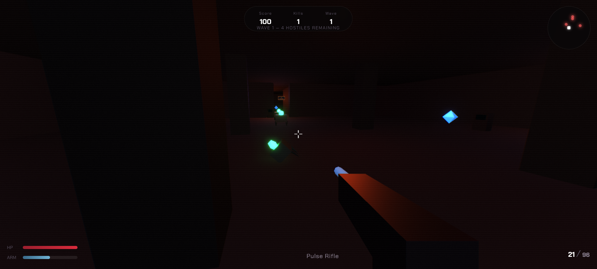
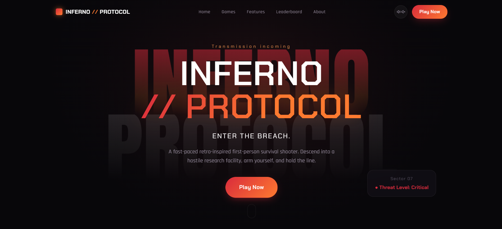

# INFERNO // PROTOCOL

An original first-person survival shooter embedded via Three.js — built for a college
web-development recruitment task. It is inspired by
the *tone* of 1990s corridor shooters, but every character, enemy, weapon,
environment, texture treatment, and line of code here is original work.
No copyrighted characters, maps, textures, logos, sounds, sprites, names,
or source code from any existing game are used anywhere in this project.

---

## 🎮 Game Preview

<p align="center">
  
  
</p>

---

## Features

**Game Hub website**
- Cinematic full-screen hero with an animated canvas particle background
- Sticky, blurring navigation with a mobile hamburger menu
- Game Hub with a featured title and three "coming soon" original titles
- Gameplay Features, Arsenal, and Threats sections with original copy
- A localStorage-backed leaderboard, structured for a future Firebase/Mongo swap
- Scroll-reveal animations, hover states, and a trailer preview modal
- Fully responsive from 375px mobile through 1920px desktop

**INFERNO // PROTOCOL (the game)**
- Real, playable first-person shooter built with Three.js + WebGL
- WASD movement, sprint, jump, mouse-look via the Pointer Lock API
- Hitscan combat with muzzle flash, hit particles, and a visible viewmodel
- Three original weapons: Pulse Rifle, Hellfire Cannon, Void Blaster
- Three original enemy types with a chase/attack AI state machine and grid-based A* navigation:
  Void Crawler, Flesh Warden, Ash Hound
- Wave-based survival with escalating difficulty
- Health/armor pickups, ammo pickups, score, kill counter, wave counter
- Full HUD: HP, armor, weapon, ammo, crosshair, damage vignette, wave banner
- Death screen with score submission to the local leaderboard
- Pause menu, controls modal, and a restart flow
- Mobile touch controls: virtual joystick, touch-look, fire/jump/reload
- Synthesized WebAudio sound effects — zero external audio dependencies

---

## Tech stack

- HTML5 / CSS3 (no framework, no Bootstrap)
- Vanilla JavaScript, ES modules throughout
- [Three.js](https://threejs.org/) r160 (loaded via CDN import map) for WebGL rendering
- Web Audio API for sound
- `localStorage` for the leaderboard and sound preference (service-layer
  wrapped so a real backend can be swapped in without touching call sites)

No build step, no bundler, no backend required.

---

## Controls

| Input | Action |
|---|---|
| `W A S D` | Move |
| `Shift` | Sprint |
| `Space` | Jump |
| Mouse | Aim |
| Left Click | Fire |
| `R` | Reload |
| `Esc` | Pause |

**Mobile:** left-side virtual joystick to move, right side of the screen to
look, with FIRE / JUMP / RLD buttons.

---

## Project structure

```
/
├── index.html                 # Marketing / Game Hub landing page
├── README.md
│
├── css/
│   ├── style.css               # Design tokens, nav, hero, marketing sections
│   ├── game.css                # HUD, menus, touch controls
│   └── responsive.css          # Breakpoints (375 / 390 / 768 / 1024 / 1440 / 1920)
│
├── js/
│   ├── app.js                  # Marketing site entry point
│   ├── navigation.js           # Sticky nav, mobile menu, sound toggle
│   ├── animations.js           # Scroll reveals, hero canvas particles, trailer modal
│   ├── leaderboard.js          # Shared localStorage service layer (site + game)
│   └── game/
│       ├── Game.js             # Orchestrator: render loop, input, waves, menus
│       ├── Player.js           # First-person controller: movement, gravity, vitals
│       ├── Weapon.js           # Ammo, reload, hitscan firing, viewmodel
│       ├── Enemy.js            # Original enemy types + low-poly meshes
│       ├── EnemyAI.js          # FSM + A* navigation, collision sliding, unstuck recovery
│       ├── Level.js            # Facility geometry, lighting, colliders, pickups
│       ├── Combat.js           # Shot resolution + pickup resolution
│       ├── HUD.js              # DOM overlay sync
│       ├── AudioManager.js     # Synthesized WebAudio sound effects
│       └── ParticleSystem.js   # Pooled THREE.Points particle effects
│
├── assets/
│   ├── images/                 # Reserved for future artwork
│   ├── textures/                # Reserved for future textures
│   ├── models/                  # Reserved for future 3D models
│   └── audio/                    # Reserved for future audio files
│
└── game/
    └── game.html               # The game page (canvas + HUD + menus)
```

---

## How to run locally

Because the game uses ES modules, it must be served over `http://`, not
opened directly as a `file://` URL.

```bash
# Option 1: Python
python3 -m http.server 8000

# Option 2: Node
npx serve .
```

Then visit `http://localhost:8000`.

---

## How to deploy

This is a fully static site — no backend, no build step.

- **Vercel / Netlify:** drag-and-drop the project folder, or connect the
  Git repository. No build command is required; the output directory is
  the project root.
- **GitHub Pages:** push to a repository and enable Pages on the `main`
  branch, root directory.

---

## Extending the leaderboard

`js/leaderboard.js` isolates all persistence behind `getScores()` and
`submitScore()`. To move off `localStorage`, replace the bodies of those
two functions (and `isSoundEnabled`/`setSoundEnabled` if desired) with
calls to Firebase, MongoDB via a small API route, or any other backend —
no other file needs to change.

---

## Credits

Designed and built as an original student project. All game concepts,
character/enemy names, weapon names, environments, and code are original
works created for this project and are not derived from any existing
commercial game's assets or source code.
